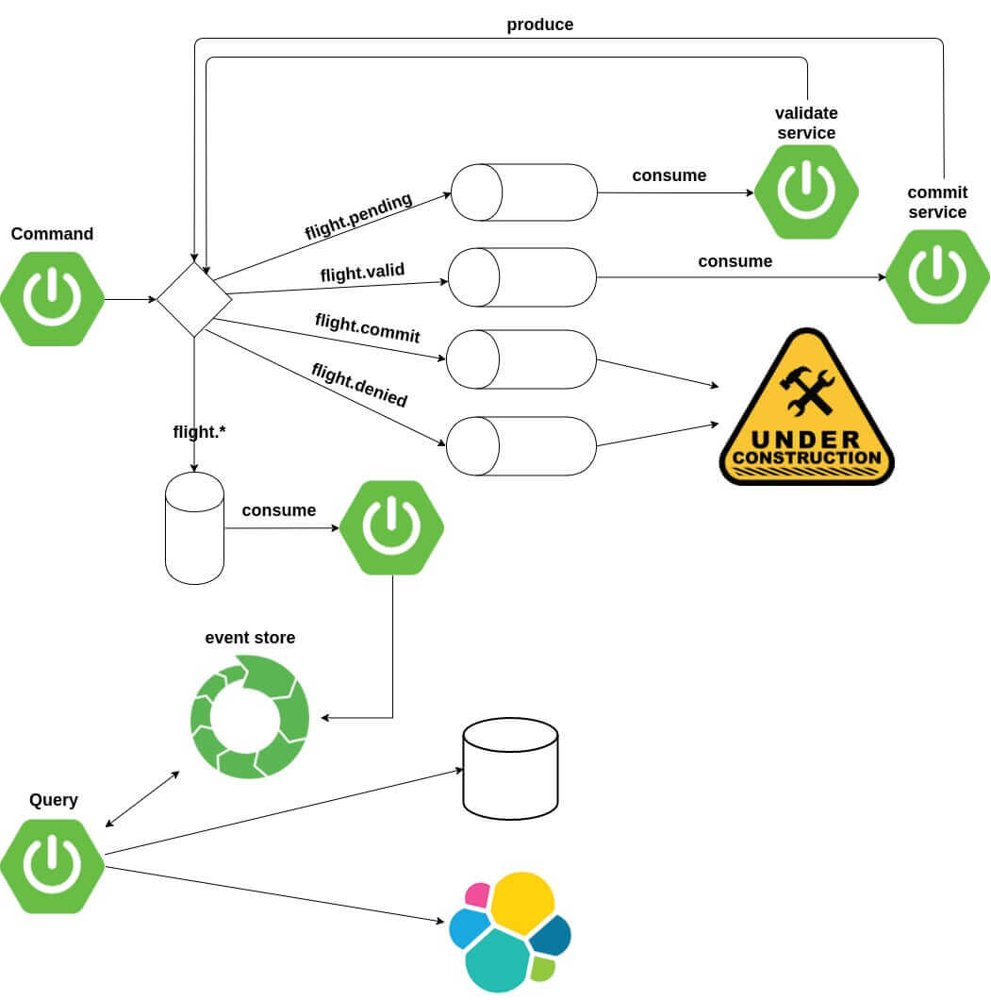

## Airport Flight System
This project is a basic airport flight system which can create fligts

### Motivation
I want to learn about event sourcing, so I build this project. I know, for learning purposes this project is to big and lot of pieces are not necessary but, I am trying to challenging myself :D

### Diagram flow

### Tech/framework used

 * [Java 8](https://www.java.com/pt_BR/download/faq/java8.xml)
 * [Spring Boot](https://spring.io/projects/spring-boot)
 * [RabbitMq](https://www.rabbitmq.com/)
 * [Elasticsearch](https://www.elastic.co/products/elasticsearch)
 * [Event Store](https://eventstore.org/)
